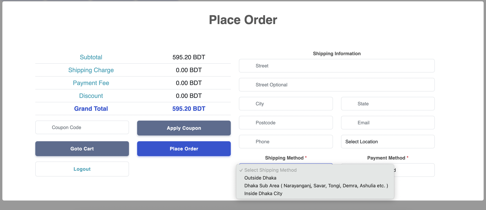

# Livemart Checkout

A standalone js library to add livemart checkout to any website.

#### Install

```html

```

#### Dependencies

- JQuery

```html
<script src="https://cdnjs.cloudflare.com/ajax/libs/jquery/3.6.0/jquery.min.js"></script>
```

- Bootstrap

```html
<script src="https://cdnjs.cloudflare.com/ajax/libs/bootstrap/5.1.0/js/bootstrap.min.js"></script>
<link rel="stylesheet" href="https://cdnjs.cloudflare.com/ajax/libs/bootstrap/5.1.0/css/bootstrap.min.css"/>
```

- AnimateJS

```html
<link rel="stylesheet" href="https://cdnjs.cloudflare.com/ajax/libs/animate.css/4.1.1/animate.min.css"/>
```

- Sweet Alert2

```html
<script src="//cdn.jsdelivr.net/npm/sweetalert2@11"></script>
```

- Stripe

```html
<script async src="https://js.stripe.com/v3/"></script>
```

### API functions

* Add item to cart

```js
add_to_cart(productId);
```

* Show cart

```js
show_cart();
```

* Set store key

```js
set_store_key(key);
```

* Set store secret

```js
set_store_secret(secret);
```

* Get store info

```js
get_store_info()
```

### Example

1. Step 1

```text
Set store key & secret. And get store info
```

2. Step 2

```text
Add items to cart
```

3. Step 3

```text
Show cart
```

Check `index.html` for details.

### UI

- Cart
  

- Checkout
  

Copyright © 2021 [LiveMart](https://livemart.store)
