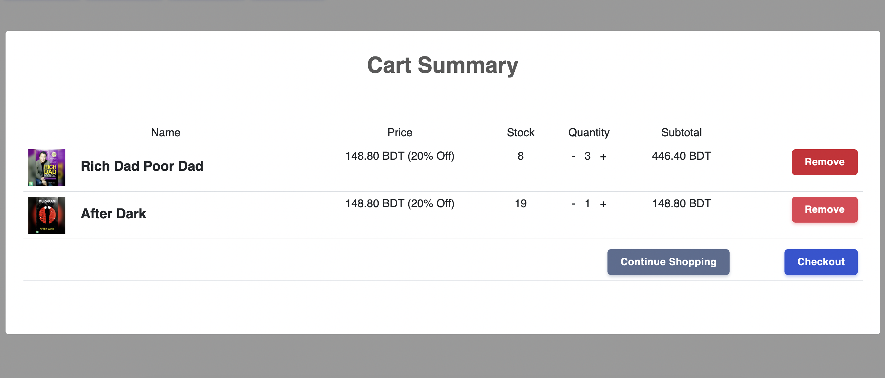

# Livemart Checkout

A standalone js library to add livemart checkout to any website.

#### Dependencies

- Sweet Alert `<script src="https://unpkg.com/sweetalert/dist/sweetalert.min.js"></script>`
- Stripe `<script src="https://js.stripe.com/v3/"></script>`

### API functions

* Add item to cart

```js
add_to_cart(productId);
```

* Show cart

```js
show_cart();
```

* Set store key

```js
set_store_key(key);
```

* Set store secret

```js
set_store_secret(secret);
```

* Get store info

```js
get_store_info()
```

### Example
```html

```

Check `index.html` for details.

### UI

- Cart
  

- Checkout
  
